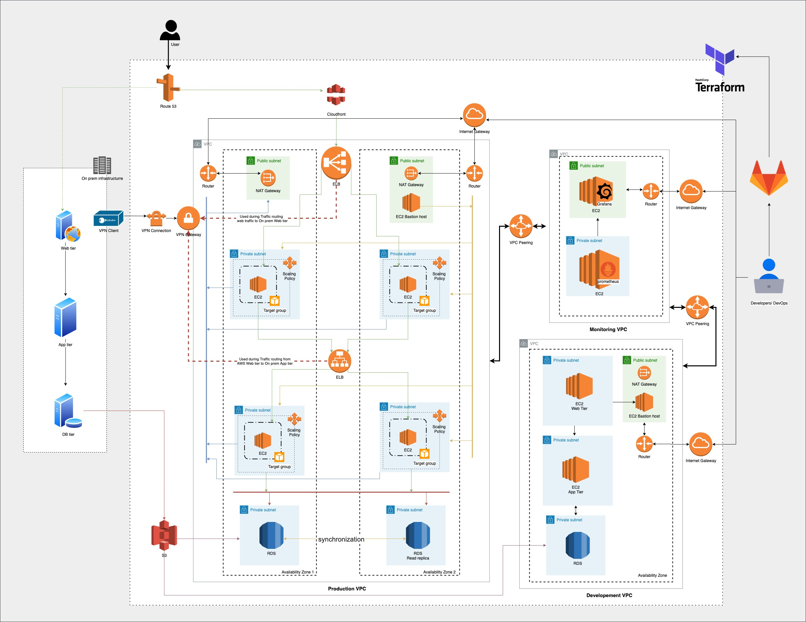

# Road to AWS
### Migrating 3 tier application to AWS cloud with minimum downtime.

#### Problem statement
Migrate typical 3- tier application; frontend, backend and persistence (A DataBase) from a datacenter to AWS.
##### Following criteria's should be satified during the migration.
1. Minimum downtime
2. Ability to withstand high peak loads. Typical peak load can be 50x of normal load and last typically 12h. During the peak hours, users access only a small portion of the site.
3. Provide multiple testing environments for developers and realistic performance testing setup while keeping cost in control at the same time.
4. Ability to test and deploy changes multiple times per day, even during the peak hours, with solid rollback in case something goes wrong.
5. The new solution should have monitoring and centralized logging across the board.

##### Additional questions
* Would you choose Baking or Frying for Image workflow?
* Which tools would you use to automate the entire process (provisioning and orchestration)?

> Final solution to problem statement and answers to additional question is part of the following solution.

## Solution
In such requirement where it is required to keep the downtime minimum, it is required to make sure that the migration is planned to happen in several steps, where each step is tested as a one unit.

### Tools and Technologies
* Packer for Baking and frying images
* Terraform for Iac
* GitLab as SCM and GitLab runners for Orchestrating

#### Monitoring and Data visualization
* Prometheous
* Grafana

#### AWS Services
* VPC, Internet gateways, NAT Gateways
* Route 53
* Elastic load balancer
* EC2 with Target groups and scaling policies
* RDS
* VPN Gateways
* s3

## Multi-stage migration steps

Inorder to make sure that there is minimal downtime during the migration, we need to perform migration in following steps:
> Note: Steps are dependant on the image above so make sure to refer it during every step for better understanding.

### Stage 1: Introduce first AWS service to existing infrastructure
1. Create an Route 53 service to point the DNS traffic via it.
2. Create a route path to Webserver tier from on premise data center.

### Stage 2: Start building Images and taking database dumps
1. Identify the requirement of the application and create two sets on images.
   1. **Baked images**(Usage: Developer): except binaries which required to run application, other tools which could be useful to developers.
   2. **Fried images**(Usage: Production): This images will be used for creating the instances for production enviornment. This will have only minimul binaries which are required for running the application.
2. Make sure this images has prometheous node exporter agent so it can be cetrally managed from Prometheous host.

3. Create and s3 bucket and start taking database dumps when there is low traffic on the application.

### Stage 3: First lets build developer infra and start monitoring
1. Prepare base templates in terraform so the whole insfrastucture of Developement VPC can be created . Use the baked images.
2. Instances type should be minimum required to maintain low cost.
3. Use database dump to load the data inside RDS.
4. Test whole application.
5. create the monitoring VPC and configure prometheous master.
6. Create basic dashboards with basic metrics in grafana.
> This creates an immutable infrastructure from the templates. There could be multiple Dev VPC created on the basis of Developer requirement.

### Stage 4: Prepare for Production Migration
1. In later stages of migration we need to route traffic via ELB inside production VPC to On prem infrastructure, so establish a VPN connection between an VPC and On prem datacenter.
2. Build a template for production VPC as shown in above picture using terraform.
3. Use GitLab runners as orchestrator for buidling the infrastructure.
4. Make sure the instances inside web ties and app tier are inside the target group, which is attached to an scaling policy.

### Stage 5: Start routing traffic from AWS
1. Create a cloudfront distribution next to route 53 and create a route for it.
2. Make a bakend configration for cloudfront to Web Elastic load balancer.
3. Route all traffic from ELB to webserver tier from datacenters.
4. Remove the direct traffic route path from rotute 53 to on prem web tier.
> Any traffic from route 53 is pointed to front end load balancer (ELB) and that traffic is routed only to web tier from on prem datacenter.

### Stage 6: Move a tier ahead
1. we already have web tier and application tier running on AWS but we are not sending any traffic to it, in this step we'll send traffic to web tier on AWS.
2. First create a route from App ELB to App tier on datacenter. (Currently there is no traffic, just routing entry)
3. In AWS Web ELB  create route to AWS web tier and start sending trafic to it.
4. Remove the route in AWS web ELB to web tier on datacenter.
> Now we have eliminated the usage of on prem web tier, all web traffic is served via app tier on AWS via web ELB on AWS. Traffic out of AWS web tier goes to App tier ELB which is served via app tier from on prem servers.

### Stage 7: End game
1. There are already database dumps inside the s3 bucket, RDS instance with read replica would already be created via terraform. Populate the data from the data dumps.
2. Create a route to app tier ELB on AWS to app tiers.
3. Remove the traffic route to app tier on prem from app tier ELB.
> Now you have moved the whole traffic from datacenter to AWS.

## Next steps
Next steps would be to migrate the application to container based infrastructure to introduce more flexibility inside the whole infrastructure. 
* Using Docker for building images
* Using containerisation service as ECS or EKS.